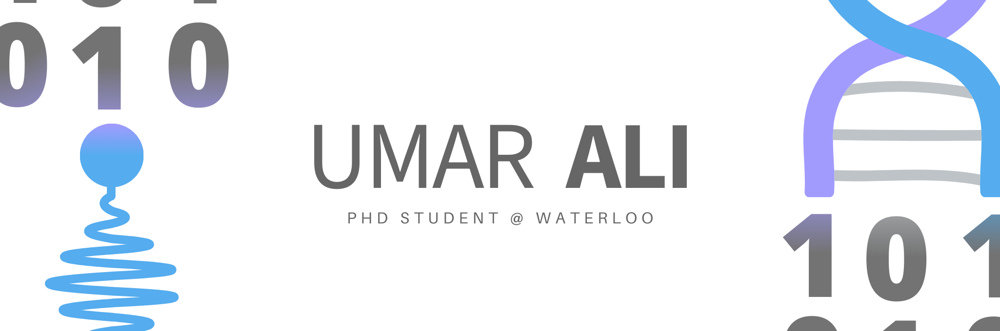

# Hey! 👋
My name is Muhammad Umar Ali and I am currently a PhD Student at the University of Waterloo. I currently research how we can engineer methods to record light-matter interactions for imaging tissue at the microscopic scale. I did my undergraduate training at the University of British Columbia with a concentration in bioinformatics. I am also an aspiring student of knowledge with a passion for research, medicine, and computer science.

<!--
## 🔧 Technologies & Tools 

-->

## ⚡ One line that describes me best? 
A wannabe scientist who pretends to know what hes doing and sometime codes too.

## 📚 My other interests
Some of my non-academic interests include: literature, entrepeneurship and dungeons & dragons! In an effort to become a more "learned person", I'm trying to write more so I've started a substack blog, please check it out @ [umara.substack.com](https://umara.substack.com/). 

